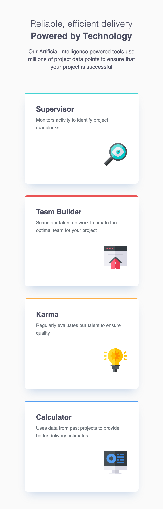

# Frontend Mentor - Four card feature section solution

This is a solution to the [Four card feature section challenge on Frontend Mentor](https://www.frontendmentor.io/challenges/four-card-feature-section-weK1eFYK). Frontend Mentor challenges help you improve your coding skills by building realistic projects.

## Table of contents

- [Overview](#overview)
  - [The challenge](#the-challenge)
  - [Screenshot](#screenshot)
  - [Links](#links)
- [My process](#my-process)
  - [Built with](#built-with)
  - [What I learned](#what-i-learned)
  - [Continued development](#continued-development)
  - [AI Collaboration](#ai-collaboration)
- [Author](#author)

## Overview

### The challenge

Users should be able to:

- View the optimal layout for the site depending on their device's screen size (mobile, tablet, and desktop)

### Screenshot




### Links

- Solution URL: [github.com/Qusbee/card-feature](https://github.com/Qusbee/card-feature)
- Live Site URL: [qusbee.github.io/card-feature](https://qusbee.github.io/card-feature/)

## My process

### Built with

- Semantic HTML5 markup
- CSS custom properties
- Flexbox
- CSS Grid (including `grid-template-areas`)
- Mobile-first workflow

### What I learned

This project was mostly about learning to see the difference between "it looks right" and "it's built correctly", and about picking the right layout tool for the job.

A few concrete things I learned:

- **`box-shadow` vs `border` vs `::before`** — I first tried to make the colored top line on each card with an `inset box-shadow`. It looked fine on the straight edges, but produced ugly little "tails" at the rounded corners, because a shadow is really just an offset copy of the box's shape, not a stroke that follows the border-radius evenly. Switching to `border-top` fixed most of it, but browsers can still render a small artifact at the corner when only one side of the border has a color. The reliable fix was a `::before` pseudo-element with its own `background-color`, combined with `overflow: hidden` and `position: relative` on the card, so the rounded corner clips the line perfectly:

```css
.card__content {
  position: relative;
  overflow: hidden;
  border-radius: 0.8rem;
}

.card__content::before {
  content: "";
  position: absolute;
  top: 0;
  left: 0;
  width: 100%;
  height: 0.4rem;
  background-color: var(--color-cyan);
}
```

- **Flexbox is one-dimensional, Grid is two-dimensional.** For the mobile layout (everything in a single column) Flexbox was enough. But the tablet and desktop layouts needed specific cards to span multiple rows or columns at once (e.g. two cards stacked in the same column on desktop), which Flexbox can't do cleanly on its own — that's exactly the kind of problem `grid-template-areas` solves.

- **`grid-template-areas`** let me "draw" the layout with names instead of numbers, and reuse the same BEM modifier classes (`--supervisor`, `--team-builder`, etc.) as the area names, so each card is placed with a single `grid-area` declaration.

- **`align-self` and `justify-self`** are the per-item versions of `align-items`/`justify-content` — useful when one specific grid or flex item needs to break from the container's general alignment rule (e.g. centering a single card that spans two rows next to a pair of stacked cards).

- **Root font-size and `rem`.** Setting `html { font-size: 62.5%; }` makes `1rem` equal `10px` by default, which makes converting design values to `rem` much easier, while still respecting a user's browser font-size settings (unlike hardcoding `font-size: 15px` on the root, which would override accessibility preferences).

- **Small bugs hide in plain sight.** A missing letter in `grid-template-areas` (`"team-builder team-builde"`) silently broke a two-column span instead of throwing an error, and a mistyped `alt` attribute (`alr=""`) silently disabled the alt text. Both looked "fine" until checked carefully — a good reminder to double check attribute names and area names character by character when something doesn't behave as expected.

### Continued development

- Get more comfortable with CSS Grid in general (`grid-auto-flow`, implicit vs explicit tracks) since a lot of the tricky bugs in this project came from mismatches between `grid-template-columns` and `grid-template-areas`.
- Practice reading design files (Figma) more precisely instead of estimating spacing/sizes "by eye".

### AI Collaboration

I used Claude (via Claude Code) throughout this project, guided by this challenge's `AGENTS.md`, which is set up to act as a mentor rather than write the code for me.

- Instead of getting finished CSS, I was asked guiding questions ("what happens if you try X?", "compare these two letter by letter") that helped me find bugs myself — for example the `box-shadow` corner artifact, the `alr`/`alt` typo, and the missing column in `grid-template-columns` on the desktop layout.
- It helped explain concepts I didn't know yet (`::before`, `grid-template-areas`, `rem` vs root font-size) with analogies before I tried to use them.
- I also used it to help write this README, since English isn't my first language and I wanted the write-up to still be clear.

## Author

- Frontend Mentor - [@Qusbee](https://www.frontendmentor.io/profile/Qusbee)
- GitHub - [@Qusbee](https://github.com/Qusbee)
